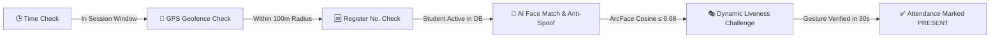

<div align="center">

# 🏢 Smart Hostel Attendance Management System
### *Next-Gen AI-Powered Biometric & Geofenced Attendance Platform*

[](https://opensource.org/licenses/MIT)
[](https://nodejs.org/)
[](https://react.dev/)
[](https://www.typescriptlang.org/)
[](https://fastapi.tiangolo.com/)
[](https://www.python.org/)
[](https://www.mongodb.com/)
[](https://tailwindcss.com/)

<p align="center">
  <b>A zero-trust, spoof-proof digital attendance system engineered for university & college hostels.</b><br>
  Replaces traditional biometric fingerprint queues with an automated, multi-factor remote verification pipeline.
</p>

---

</div>

## 📌 Key Highlights

- 🔒 **Zero-Trust Multi-Stage Verification**: 5-step sequential validation before marking attendance `PRESENT`.
- 📍 **Strict GPS Geofencing**: Real-time Haversine distance calculations restrict attendance strictly to physical hostel premises.
- 🤖 **DeepFace ArcFace AI Recognition**: Sub-second 512-D facial feature extraction and cosine distance similarity matching ($\le 0.68$).
- 🛡️ **Anti-Spoofing & Liveness Detection**: Real-time presentation attack detection against screen replays, paper photos, and randomized interactive gesture challenges (head turns, smiles, blinks, gestures).
- ⚡ **Real-Time WebSockets**: Instant live attendance stream to the Admin Dashboard powered by Socket.IO.
- 📊 **Comprehensive Admin Suite**: Manage students, scheduled sessions, historical logs, verification attempt audits, and isolated AI face debugging.

---

## 🔄 5-Stage Verification Pipeline



| Step | Stage | Mechanism & Verification Criteria |
| :---: | :--- | :--- |
| **1** | **Time Window Check** | Server-enforced session schedule validation ($StartTime \le CurrentTime \le EndTime$). |
| **2** | **GPS Geofence** | Device coordinates validated against hostel GPS center via Haversine formula ($Distance \le Radius$). |
| **3** | **Registration Check** | Validates active enrollment status in database against assigned hostel blocks. |
| **4** | **AI Facial Identity** | Python FastAPI ArcFace + RetinaFace model matching with real-time Anti-Spoofing protection. |
| **5** | **Randomized Liveness** | Cryptographically salted nonce challenge (head rotation, blink, smile, hand sign) with 30s TTL. |

---

## 🛠️ Architecture & Tech Stack

```
hostel_attendance/
├── client/              # React 18 + TypeScript + Vite + Tailwind CSS (SPA Frontend)
├── server/              # Node.js + Express + TypeScript + Socket.IO + MongoDB (Core Backend)
└── ai-service/          # Python FastAPI + DeepFace + RetinaFace + OpenCV (Biometric Microservice)
```

### 💻 Technology Matrix

| Layer | Technologies Used |
| :--- | :--- |
| **Frontend UI/UX** | React 18, TypeScript, Vite, Tailwind CSS, Lucide Icons, Canvas Confetti |
| **Client Biometrics**| MediaPipe Tasks Vision, HTML5 Canvas 3D Landmark Detectors |
| **Real-time Comms** | Socket.IO (Client & Server) |
| **Backend Core** | Node.js, Express.js, TypeScript, Mongoose ODM, Zod, Helmet, CORS |
| **AI & Vision Engine** | Python 3.10+, FastAPI, Uvicorn, DeepFace, ArcFace, RetinaFace, OpenCV, NumPy |
| **Database** | MongoDB 6.0+ (Indexes on Sessions, Students, Attendance Logs) |
| **Security** | JWT Authentication, Bcrypt Password Hashing, Ephemeral Challenge Nonces, Rate Limiting |

---

## 🚀 Quick Start Guide

### Prerequisites
- [Node.js](https://nodejs.org/) (v18.0.0 or higher)
- [MongoDB](https://www.mongodb.com/try/download/community) installed and running locally on port `27017`
- [Python](https://www.python.org/) (v3.10 or v3.11) *(optional for running dedicated AI service locally)*

---

### 1️⃣ Clone the Repository
```bash
git clone https://github.com/vishnu6383/hostel_attedance-.git
cd hostel_attedance-
```

---

### 2️⃣ Backend Server Setup

```bash
# Navigate to backend directory
cd server

# Install Node dependencies
npm install

# Setup environment file
cp .env.example .env

# Seed initial admin account and sample student database
npm run seed

# Start server in development mode
npm run dev
```
> 🌐 **Backend API**: `http://localhost:5000`  
> 🩺 **Health Check**: `http://localhost:5000/api/health`

---

### 3️⃣ Frontend Client Setup

```bash
# Open a new terminal and navigate to client directory
cd client

# Install client dependencies
npm install

# Start Vite React development server
npm run dev
```
> 💻 **Frontend Web App**: `http://localhost:5173`

---

### 4️⃣ Python AI Microservice *(Optional / Advanced Biometrics)*

```bash
# Open a new terminal and navigate to ai-service directory
cd ai-service

# Create and activate virtual environment
python -m venv .venv
# On Windows:
.venv\Scripts\activate
# On Linux/macOS:
source .venv/bin/activate

# Install AI dependencies
pip install -r requirements.txt

# Start FastAPI server
uvicorn app.main:app --host 127.0.0.1 --port 8000 --reload
```
> 🤖 **AI Service API**: `http://127.0.0.1:8000`  
> 📖 **Swagger Docs**: `http://127.0.0.1:8000/docs`

---

## 🔑 Default Credentials & Demo Accounts

### 👑 Admin Portal
- **Login URL**: [`http://localhost:5173/admin/login`](http://localhost:5173/admin/login)
- **Email**: `admin@hostel.com`
- **Password**: `admin123`

### 🎓 Sample Enrolled Students
| Register Number | Student Name | Department | Block & Room |
| :---: | :---: | :---: | :---: |
| `23ADS001` | Aravind Kumar | Artificial Intelligence & Data Science | Block A - 101 |
| `23ADS002` | Bhavna Sharma | Artificial Intelligence & Data Science | Block A - 102 |
| `23CSE015` | Chaitanya Reddy | Computer Science & Engineering | Block A - 204 |
| `23ECE042` | Deepak Verma | Electronics & Communication | Block B - 108 |

---

## ⚙️ Environment Configuration

| Variable | Default Value | Description |
| :--- | :--- | :--- |
| `PORT` | `5000` | Node.js Backend Server Port |
| `MONGODB_URI` | `mongodb://localhost:27017/hostel_attendance` | MongoDB Connection URI |
| `JWT_SECRET` | `super_secret_hostel_jwt_key_2026` | Secret key for admin JWT tokens |
| `HOSTEL_LATITUDE` | `11.055548` | Hostel Center GPS Latitude |
| `HOSTEL_LONGITUDE` | `78.047153` | Hostel Center GPS Longitude |
| `HOSTEL_GEOFENCE_RADIUS_METERS` | `100` | Allowed GPS radius in meters |
| `TIMEZONE` | `Asia/Kolkata` | Timezone for attendance windows |
| `CLIENT_URL` | `http://localhost:5173` | Allowed CORS client origin |
| `AI_SERVICE_URL` | `http://127.0.0.1:8000` | Python FastAPI AI Microservice URL |

---

## 📱 Mobile Device Geolocation & Camera Access

Mobile web browsers (iOS Safari, Android Chrome) enforce security policies requiring **HTTPS** (or `localhost`) for:
1. **Camera Access** (`navigator.mediaDevices.getUserMedia`)
2. **GPS Geolocation** (`navigator.geolocation.getCurrentPosition`)

### Testing on Physical Mobile Devices Locally:
To test on a physical mobile device connected to the same Wi-Fi network:
```bash
# Start an HTTPS reverse-proxy tunnel with ngrok
npx ngrok http 5173
```
Open the generated `https://xxxx.ngrok-free.app` URL on your phone browser.

---

## 📄 License

This project is licensed under the **MIT License** — feel free to customize and deploy for educational, institutional, or commercial use.
